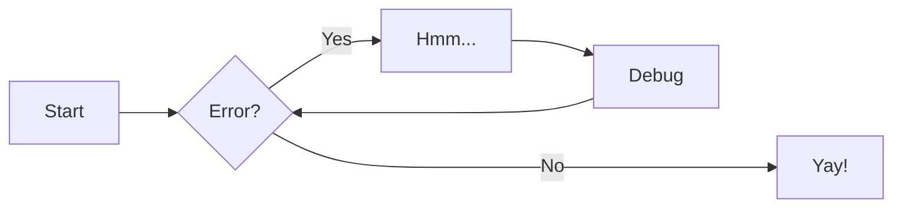

https://github.com/giovbon/docs

python3 venve .venv
source .venv/bin/activate
pip install zensical


zensical serve
zensical serve -a localhost:8080


----

## Bloqueio de paginas por data

```
<div class="page-unlock" data-unlock-date="2026-04-02"></div>
<div class="page-unlock" data-unlock-date="2026-04-02" data-unlock-password="1q2w3e"></div>
```

# Referência

For full documentation visit [zensical.org](https://zensical.org/docs/).

## Commands

* [`zensical new`][new] - Create a new project
* [`zensical serve`][serve] - Start local web server
* [`zensical build`][build] - Build your site

  [new]: https://zensical.org/docs/usage/new/
  [serve]: https://zensical.org/docs/usage/preview/
  [build]: https://zensical.org/docs/usage/build/

## Examples

### Admonitions

> Go to [documentation](https://zensical.org/docs/authoring/admonitions/)

!!! note

    This is a **note** admonition. Use it to provide helpful information.

!!! warning

    This is a **warning** admonition. Be careful!

### Details

> Go to [documentation](https://zensical.org/docs/authoring/admonitions/#collapsible-blocks)

??? info "Click to expand for more info"
    
    This content is hidden until you click to expand it.
    Great for FAQs or long explanations.

## Code Blocks

> Go to [documentation](https://zensical.org/docs/authoring/code-blocks/)

``` python hl_lines="2" title="Code blocks"
def greet(name):
    print(f"Hello, {name}!") # (1)!

greet("Python")
```

1.  > Go to [documentation](https://zensical.org/docs/authoring/code-blocks/#code-annotations)

    Code annotations allow to attach notes to lines of code.

Code can also be highlighted inline: `#!python print("Hello, Python!")`.

## Content tabs

> Go to [documentation](https://zensical.org/docs/authoring/content-tabs/)

=== "Python"

    ``` python
    print("Hello from Python!")
    ```

=== "Rust"

    ``` rs
    println!("Hello from Rust!");
    ```

## Diagrams

> Go to [documentation](https://zensical.org/docs/authoring/diagrams/)



## Footnotes

> Go to [documentation](https://zensical.org/docs/authoring/footnotes/)

Here's a sentence with a footnote.[^1]

Hover it, to see a tooltip.

[^1]: This is the footnote.


## Formatting

> Go to [documentation](https://zensical.org/docs/authoring/formatting/)

- ==This was marked (highlight)==
- ^^This was inserted (underline)^^
- ~~This was deleted (strikethrough)~~
- H~2~O
- A^T^A
- ++ctrl+alt+del++

## Icons, Emojis

> Go to [documentation](https://zensical.org/docs/authoring/icons-emojis/)

* :sparkles: `:sparkles:`
* :rocket: `:rocket:`
* :tada: `:tada:`
* :memo: `:memo:`
* :eyes: `:eyes:`

## Maths

> Go to [documentation](https://zensical.org/docs/authoring/math/)

$$
\cos x=\sum_{k=0}^{\infty}\frac{(-1)^k}{(2k)!}x^{2k}
$$

!!! warning "Needs configuration"
    Note that MathJax is included via a `script` tag on this page and is not
    configured in the generated default configuration to avoid including it
    in a pages that do not need it. See the documentation for details on how
    to configure it on all your pages if they are more Maths-heavy than these
    simple starter pages.

<script id="MathJax-script" async src="https://unpkg.com/mathjax@3/es5/tex-mml-chtml.js"></script>
<script>
  window.MathJax = {
    tex: {
      inlineMath: [["\\(", "\\)"]],
      displayMath: [["\\[", "\\]"]],
      processEscapes: true,
      processEnvironments: true
    },
    options: {
      ignoreHtmlClass: ".*|",
      processHtmlClass: "arithmatex"
    }
  };
</script>

## Task Lists

> Go to [documentation](https://zensical.org/docs/authoring/lists/#using-task-lists)

* [x] Install Zensical
* [x] Configure `zensical.toml`
* [x] Write amazing documentation
* [ ] Deploy anywhere

## Tooltips

> Go to [documentation](https://zensical.org/docs/authoring/tooltips/)

[Hover me][example]

  [example]: https://example.com "I'm a tooltip!"


## Markdown in 5min

### Headers
```
# H1 Header
## H2 Header
### H3 Header
#### H4 Header
##### H5 Header
###### H6 Header
```

### Text formatting
```
**bold text**
*italic text*
***bold and italic***
~~strikethrough~~
`inline code`
```

### Links and images
```
[Link text](https://example.com)
[Link with title](https://example.com "Hover title")


```

### Lists
```
Unordered:
- Item 1
- Item 2
  - Nested item

Ordered:
1. First item
2. Second item
3. Third item
```

### Blockquotes
```
> This is a blockquote
> Multiple lines
>> Nested quote
```

### Code blocks
````
```javascript
function hello() {
  console.log("Hello, world!");
}
```
````

### Tables
```
| Header 1 | Header 2 | Header 3 |
|----------|----------|----------|
| Row 1    | Data     | Data     |
| Row 2    | Data     | Data     |
```

### Horizontal rule
```
---
or
***
or
___
```

### Task lists
```
- [x] Completed task
- [ ] Incomplete task
- [ ] Another task
```

### Escaping characters
```
Use backslash to escape: \* \_ \# \`
```

### Line breaks
```
End a line with two spaces  
to create a line break.

Or use a blank line for a new paragraph.
```

---


<div class="grid cards" markdown>

- :simple-html5: __HTML__ for content and structure
- :simple-javascript: __JavaScript__ for interactivity
- :simple-css: __CSS__ for text running out of boxes

</div>

---

<div class="grid cards" markdown>

-   :material-clock-fast:{ .lg .middle } __Set up in 5 minutes__

    ---

    Install [`zensical`](#) with [`pip`](#) and get up
    and running in minutes

    [:octicons-arrow-right-24: Getting started](#)

-   :fontawesome-brands-markdown:{ .lg .middle } __It's just Markdown__

    ---

    Focus on your content and generate a responsive and searchable static site

    [:octicons-arrow-right-24: Reference](#)

-   :material-format-font:{ .lg .middle } __Made to measure__

    ---

    Change the colors, fonts, language, icons, logo and more with a few lines

    [:octicons-arrow-right-24: Customization](#)

-   :material-scale-balance:{ .lg .middle } __Open Source, MIT__

    ---

    Zensical is licensed under MIT and available on [GitHub]

    [:octicons-arrow-right-24: License](#)

</div>

---

<figure markdown="span">
  { width="300" }
  <figcaption>Image caption</figcaption>
</figure>


# Teste de Markmap

Este arquivo testa a implementação do Markmap no Zensical.

## 1. Mapa Mental Inline

Abaixo está um mapa mental renderizado diretamente do HTML/Markdown inline:

<div class="markmap">
<pre>
# Markmap Inline
## Recursos
- Renderização Instantânea
- Suporte a Markdown
    - Olha essa ferinha!
- Zoom e Pan
## Estilos
- Personalizável via CSS
- Suporte a Dark Mode
</pre>
</div>

---

## 2. Mapa Mental de Arquivo Externo (.txt)

Este mapa mental é carregado a partir de um arquivo `.txt` externo:

<div class="markmap" data-src="../mindmap.txt"></div>

---

## Como usar

Para incluir um mapa mental em seus arquivos `.md`, use a classe `markmap`:

```html
<div class="markmap">
# Seu Título
## Tópico 1
## Tópico 2
</div>
```

Para carregar de um arquivo externo:

```html
<div class="markmap" data-src="caminho/para/arquivo.txt"></div>
```


---


# Asciinema

Este arquivo testa a integração do Asciinema no Markdown.

## Exemplo 1: Via ID (asciinema.org)

Aqui carregamos um vídeo pelo ID do asciinema.org.

<div class="asciinema" data-src="612345"></div>

## Exemplo 2: Via URL Direta (.cast)

Aqui carregamos um arquivo `.cast`.

<div class="asciinema" data-src="./minha_gravacao.cast" data-speed="1" data-idle-time-limit="4" data-theme="tango"></div>

## Exemplo 3: Código do Arquivo (.cast) Inline

Aqui passamos o "código" do vídeo diretamente no Markdown, colando o conteúdo de um arquivo `.cast` (Asciicast v2). 

<div class="asciinema">
<pre>
{"version": 2, "width": 80, "height": 10, "title": "Exemplo Inline"}
[0.1, "o", "\u001b[32mHello from Antigravity!\r\n\u001b[0m"]
[0.5, "o", "Implementing Asciinema support...\r\n"]
[1.0, "o", "Done!"]
</pre>
</div>

---

### Opções suportadas:

Você pode passar atributos `data-*` para customizar o player:
- `data-speed`: Velocidade (ex: 2)
- `data-theme`: Tema (ex: monokai, solarized-dark)
- `data-idle-time-limit`: Limite de tempo ocioso
- `data-poster`: Frame inicial (ex: npt:1:30)


# Destaque de Código

```python [1|1-2|1-4]
def somar(a, b):
    resultado = a + b
    
    return resultado
```

## Code Explorer

`<div class="code-explorer" data-src="../../zCODE/CTT09-repo.txt" ></div>`

# gerar_explorador.py

`python gerar_explorador.py ./docs/ -o ./docs/arquivos/estrutura.txt`

Especificando arquivos, pastas e extensões para serem ignorados: `python3 gerar_explorador.py ./minha_pasta --ignore-dirs "logs,temp" --ignore-files "secret.py" --ignore-exts ".log,.tmp"`

O comando é formado por 4 partes. É como se você estivesse dando uma instrução falada para o computador:

python gerar_explorador.py (O que faz): Avisa o computador: "Ei, execute aquele script que acabamos de criar."

./docs/ (O que faz): É o alvo. Você está dizendo: "Eu quero que você leia absolutamente todos os arquivos e pastas que estão dentro da pasta chamada docs." (Você pode trocar isso por qualquer outra pasta do seu computador).

-o (O que faz): Vem da palavra "Output" (Saída). Significa: "Pegue tudo o que você leu na pasta alvo, e salve o resultado no seguinte lugar..."

./docs/arquivos/estrutura.txt (O que faz): É o destino. O script vai criar (ou substituir) um arquivo de texto exatamente nesse caminho e despejar toda aquela formatação chata de indentações e códigos ali dentro.

Usos comuns:

- `python3 gerar_explorador.py . --ignore-dirs "backup"`
- `python3 gerar_explorador.py . --ignore-exts ".tmp,.swp,.bak"`
- `python3 gerar_explorador.py . --ignore-dirs "venv" --ignore-files "poetry.lock"`

Se você não definir o caminho usando `-o`, o script salvará o arquivo com o nome **`estrutura.txt`** diretamente na **pasta onde você está no terminal** (o diretório de trabalho atual).

Por exemplo:

1. Se você estiver na pasta `/home/giobon/meu-projeto/` e rodar:
   ```bash
   python3 gerar_explorador.py ./docs/
   ```
   O arquivo será criado em: `/home/giobon/meu-projeto/estrutura.txt`.

### Resumo do Comportamento:
- **Sem `-o`**: Salva como `estrutura.txt` na pasta atual.
- **Com `-o arquivo.txt`**: Salva como `arquivo.txt` na pasta atual.
- **Com `-o pasta/sub/arquivo.txt`**: Salva dentro da estrutura de pastas especificada (e agora, graças à nossa última atualização, ele cria as pastas automaticamente se elas não existirem).

## Comentários no código

Com `#@@[Cria uma nova instância do usuário atual, chamada `user_atualizado`, aplicando as alterações contidas em `update_data`. O método `model_copy` do Pydantic é utilizado para gerar uma cópia do objeto original, mesclando os novos dados com os existentes.]`

