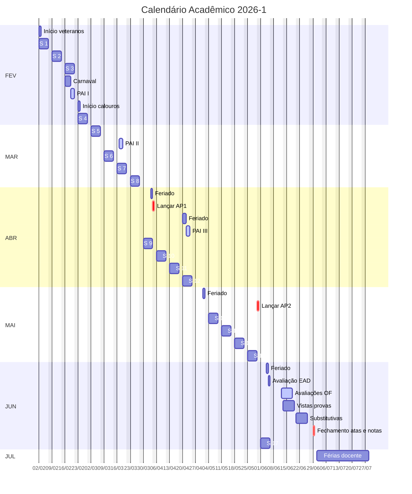

---
hide:
  - toc
  - navigation
search:
  exclude: true
---

# Cal. Acad. 2026-1

```mermaid
gantt
    title Calendário Acadêmico 2026-1
    dateFormat  YYYY-MM-DD
    axisFormat %d/%m
    tickInterval 1week
    weekday monday
    excludes weekends

    section FEV
Início veteranos	:a2, 2026-02-02, 1d
S 1			:s1, 2026-02-02, 5d
S 2            	:s2, after s1, 5d
S 3          	        :s3, after s2, 5d
Carnaval		:a2, 2026-02-16, 3d
PAI I			:active, 2026-02-19, 2d
Início calouros		:a2, 2026-02-23, 1d
S 4         	        :s4, after s3, 5d
    section MAR
S 5         	        :s5, after s4, 5d
PAI II			:active, 2026-03-17, 2d
S 6         	        :s6, after s5, 5d
S 7         	        :s7, after s6, 5d
S 8         	        :s8, after s7, 5d
    section ABR
Feriado			:a2, 2026-04-03, 1d
Lançar AP1		:crit, 2026-04-04, 1d
Feriado			:a2, 2026-04-20, 2d
PAI III			:active, 2026-04-22, 2d
S 9         	        :s9, after s8, 5d
S 10         	        :s10, after s9, 5d
S 11         	        :s11, after s10, 5d
S 12         	        :s12, after s11, 5d
    section MAI
Feriado			:a2, 2026-05-01, 1d
Lançar AP2		:crit, 2026-05-30, 1d
S 13		:s13, 2026-05-04, 5d
S 14		:s14, after s13, 5d
S 15		:s15, after s14, 5d
S 16		:s16, after s15, 5d
    section JUN
Feriado			:a2, 2026-06-04, 1d
Avaliação EAD			:a2, 2026-06-05, 1d
Avaliações OF		:active, 2026-06-12, 2026-06-18
Vistas provas		:a2, 2026-06-13, 2026-06-19
Substitutivas		:a2, 2026-06-20, 2026-06-26
Fechamento atas e notas	:crit, 2026-06-29, 1d
S 17		:s17, after s16, 5d
    section JUL
Férias docente		:a2, 2026-07-01, 2026-07-29
```